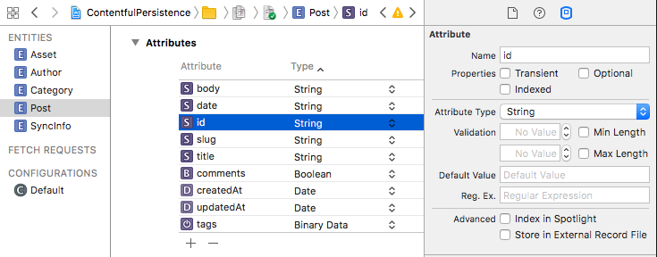

# contentful-persistence.swift

[](http://cocoadocs.org/docsets/ContentfulPersistenceSwift)
[](https://github.com/Carthage/Carthage)
[](http://cocoadocs.org/docsets/ContentfulPersistenceSwift)
[](http://cocoadocs.org/docsets/ContentfulPersistenceSwift)
[](https://travis-ci.org/contentful/contentful-persistence.swift)
[](https://coveralls.io/github/contentful/contentful-persistence.swift)

Simplified persistence for the [Contentful][1] [Swift SDK][2].

[Contentful][1] is a content management platform for web applications, mobile apps and connected devices. It allows you to create, edit & manage content in the cloud and publish it anywhere via powerful API. Contentful offers tools for managing editorial teams and enabling cooperation between organizations.

## Usage

The `SynchronizationManager` manages the state of your CoreData database and keeps it in sync with the data from your Contentful Space:

```swift
// Tell the library which of your `NSManagedObject` subclasses that conform to `EntryPersistable` should be used when mapping API resonses to CoreData entities.
let entryTypes = [Author.self, Category.self, Post.self]

// Initialize the data store and it's schema.
let store = CoreDataStore(context: self.managedObjectContext)
let persistenceModel = PersistenceModel(spaceType: SyncInfo.self, assetType: Asset.self, entryTypes: entryTypes)

// Create the manager.
let syncManager = SynchronizationManager(persistenceStore: self.store, persistenceModel: persistenceModel)

// Initialize the Contentful.Client with a persistenceIntegration which will receive messages about changes when calling `sync methods`
self.client = Client(spaceId: "<YOUR_SPACE_ID>", accessToken: "<YOUR_ACCESS_TOKEN>", persistenceIntegration: syncManager)

// Sync with the API. 
self.client.initialSync().then { _ in
  // Make sure to delegate to the correct thread.
  self.managedObjectContext.perform { 
    do {
      // Fetch all `Posts` from CoreData
      let post: Post? = try self.store.fetchAll(type: Post.self, predicate: NSPredicate(value: true))
    } catch {
      // Handle error thrown by CoreData fetches.
    }
  }
}
```

## Define your `CoreData` model

To make your model classes work with contentful-persistence.swift you will need to either conform to `ContentPersistable` for Contentful Assets, or `EntryPersistable` for Contentful entry types.

Then you will need to make the corresponding model in your projects `xcdatamodel` file. Both `EntryPersistable` and `ContentPersistable` types must have a _non-optional_ `id` property as well as optional `createdAt` and `updatedAt` date properties.

Optionality on CoreData entities is a bit different than swift optionality—optionality means that the property may be absent when a save-to-database operation is performed. To configure a property's optionality, open the "Data Model Inspector" in Xcode's "Utilities" right sidebar and toggle the "Optional" checkbox:



The mapping of Contentful fields to your data model entities will be derived automatically, but you can also customize it, by implementing the `static func mapping() -> [FieldName: String]?` on your class.

Here is an example of a model class:

```swift
import Foundation
import CoreData
import ContentfulPersistence
import Contentful

@objc(Post)
class Post: NSManagedObject, EntryPersistable {
      
    // The identifier of the corresponding Content Type in Contentful.
    static let contentTypeId = "2wKn6yEnZewu2SCCkus4as"

    @NSManaged var id: String
    @NSManaged var createdAt: Date?
    @NSManaged var updatedAt: Date?
    @NSManaged var body: String?
    @NSManaged var comments: NSNumber?
    @NSManaged var date: NSDate?
    @NSManaged var slug: String?
    @NSManaged var tags: Data?
    @NSManaged var title: String?
    @NSManaged var author: NSOrderedSet?
    @NSManaged var category: NSOrderedSet?
    @NSManaged var featuredImage: Asset?

    // Override auto-derived mapping. In the below example, only the `title` property will be populated.
    static func mapping() -> [FieldName: String]? {
        return ["title": "title"]
    }
}
```

## Documentation

For further information, check out the [Developer Documentation][4] or browse the [API documentation][3]. The latter can also be loaded into Xcode as a Docset.

### CocoaPods installation

[CocoaPods][5] is the dependency manager for Objective-C and Swift, which automates and simplifies the process of using 3rd-party libraries like the ContentfulPersistence in your projects.

```ruby
platform :ios, '8.0'
use_frameworks!

target :MyApp do
	pod 'ContentfulPersistenceSwift', '~> 0.5.0'
end
```

### Carthage installation

You can also use [Carthage][6] for integration by adding the following to your `Cartfile`:

```
github "contentful/contentful.swift" ~> 0.5.0
```

## Unit Tests

To run the tests, do the following steps:

```
$ make setup_env
$ carthage bootstrap --platform all
$ make test
```
or run them directly from Xcode.

## License

Copyright (c) 2017 Contentful GmbH. See LICENSE for further details.

[1]: https://www.contentful.com
[2]: https://github.com/contentful/contentful.swift
[3]: http://cocoadocs.org/docsets/ContentfulPersistenceSwift/
[4]: https://www.contentful.com/developers/docs/references/content-delivery-api/
[5]: https://cocoapods.org/
[6]: https://github.com/Carthage/Carthage

